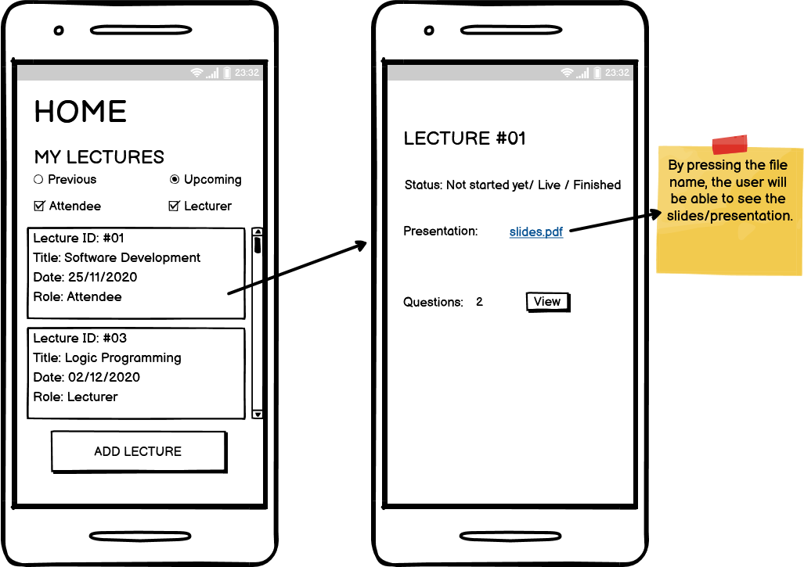

# AskIt

Team members:

<ul>
  <li>Fabio Moreira </li>
  <li>Luís Afonso  </li>
  <li>João Cunha </li>
  <li>Pedro Coelho </li>
  <li>José Maçães </li>
 </ul>

## Product Vision

AskIt, a platform to manage the very limited time to ask questions at the end of the lecture, ensuring the best ones get answered first.

## Elevator Pitch

Have you ever felt frustrated by the lack of quality of the questions taking up the very limited time at the end of lectures?
AskIt optimizes everyone's experience by allowing all the attendees to vote on the best questions, leading to a better use of the time.
From now on you can attend any conference knowing that only the most pertinent questions will be asked, leading to more intriguing discussions.

## Requirements

### Use case diagram


#### AskIt

**Actor**: Atendee  
**Description**: User can post questions regarding the lecture he is attending. He can also mark the number of the slide relevant to his question.  
**Normal Flow**: The user writes a question, selects the slide number and then submits the question.

#### See Slides

**Actor**: Atendee  
**Description**: User can download the presentation if it has been made available by the speaker.  
**Normal Flow**: User downloads the presentation file.

#### Rate Questions

**Actor**: Atendee  
**Description**: User sees all questions in a list and may choose to rate any question.  
**Normal Flow**: User scrolls through the list and votes on the questions he desires.

#### Submit Presentation

**Actor**: Speaker  
**Description**: User may choose a file from his device and upload it into the app.  
**Normal Flow**: User presses upload lecture, and navigates through his device to select the file to upload.

#### See Questions

**Actor**: Speaker  
**Description**: User sees the list of questions ordered by their current rating.  
**Normal Flow**: User can scroll through the list of submitted questions.

#### Answer Questions Post Lecture

**Actor**: Speaker  
**Description**: After the lecture has ended, the user may submit an answer to questions that there was no time for.  
**Normal Flow**: User selects one question and may submit an answer.

### User stories

### - User story #01(Login):

As a user, I want to log into the app.

#### User interface mockup


#### Acceptance tests

```gherkin
  Scenario:
  Given There are fields for user to input email and password
  When User fills those fields
  And The information is correct
  Then The user is logged in
```

```gherkin
  Scenario:
  Given There are fields for user to input email and password
  When User fills those fields
  And The information is incorrect
  Then The user is not logged in
```

#### Value and effort

Value: Must have

Effort: M

### - User story #02(See My Lectures):

As a user, I want to filter and view lectures that I have attended or will attend.

#### User interface mockup


#### Acceptance tests

```gherkin
  Scenario:
  Given A list of lectures associated with the user
  When User selects the "lecturer" filter
  Then Only lectures where user was the lecturer are displayed
```

```gherkin
  Scenario:
  Given A list of lectures associated with the user
  When User selects the "attendee" filter
  Then Only lectures where user was an attendee are displayed
```

```gherkin
  Scenario:
  Given A list of lectures associated with the user
  When User selects the "upcoming" filter
  Then Only lectures that will be happening in the future are displayed
```

```gherkin
  Scenario:
  Given A list of lectures associated with the user
  When User selects the "previous" filter
  Then Only lectures that already happened will be displayed
```

#### Value and effort

Value: Must have

Effort: S

### - User story #03(Create Lecture):

As a lecturer, I can create a new lecture

#### User interface mockup


#### Acceptance tests

```gherkin
  Scenario:
  Given The form for creating a new lecture
  When User fills all the fields
  Then A new lecture is created and added to the user's lectures list with role "Lecturer"
```

```gherkin
  Scenario:
  Given The form for creating a new lecture
  When User selects a date in the past
  Then The creation process fails and an error message is displayed

```

#### Value and effort

Value: Must have

Effort: L

### - User story #04(Choose lecture to attend):

As a user, I want to be able to see upcoming lectures (w/ filters) and choose one to attend.

#### User interface mockup


#### Acceptance tests

```gherkin
  Scenario:
  Given A list of the upcoming lectures
  When User presses the lecture they want to attend
  And They press the "Join" button
  Then Lecture is added to the lectures list of the user with role "Attendee"
```

```gherkin
  Scenario:
  Given A list of the upcoming lectures
  When User selects a lecture that is already at maximum capacity
  Then Message is displayed to the user letting them know lecture is full
```

#### Value and effort

Value: Must have

Effort: L

### - User story #05(Update Status of Presentation):

As a lecturer, I can change the status of my presentation (Live/Finished)

#### User interface mockup


#### Acceptance tests

```gherkin
  Scenario:
  Given The options regarding the status of the lecture
  When The current status is "Not started yet"
  And User presses "Live"
  Then The status should change to "Live"

```

```gherkin
  Scenario:
  Given The options regarding the status of the lecture
  When The current status is "Live"
  And User presses "Finished"
  Then The status should change to "Finished"
```

```gherkin
  Scenario:
  Given The options regarding the status of the lecture
  When The current status is "Live"
  And User presses "Not started yet"
  Then The status should not change
  And An error message should be displayed

```

```gherkin
  Scenario:
  Given The options regarding the status of the lecture
  When The current status is "Finished"
  And User presses any other state
  Then The status should not change
  And An error message should be displayed
```

#### Value and effort

Value: Should have

Effort: L

### - User story #06(Submit Presentation):

As a lecturer I can submit my presentation so that attendees can follow along my presentation.

#### User interface mockup


#### Acceptance tests

```gherkin
  Scenario:
  Given Lecturer is on the page of the Lecture
  When Lecturer presses the "Select File" button
  And Chooses a file
  Then The file should be uploaded

```

#### Value and effort

Value: Must have

Effort: S

### - User story #07(Download Presentation):

As an attendee, I can access the slides submitted by the lecturer to follow along

#### User interface mockup



#### Acceptance tests

```gherkin
  Scenario:
  Given Lecturer submitted slides
  When The user is on the lecture page
  And User presses the name of the file
  Then The presentation file should open

```

```gherkin
  Scenario:
  Given Lecturer did not submit the presentation
  When The user is on the lecture page
  Then Message should be displayed that slides are not available
```

#### Value and effort

Value: Must have

Effort: M

### - User story #08(Select Slide Number):

As a user I can select which slide I have a doubt so that it is easier for the lecturer to answer my question.

#### User interface mockup


#### Acceptance tests

```gherkin
  Scenario:
  Given User is in the process of submitting a question
  When The user selects the slide number of the question
  And Submits it
  Then The question description should have the correct slide number associated with it
```

#### Value and effort

Value: Must have

Effort: S

### - User story #09(Vote on Questions):

As a user, I can vote on which questions I like the most so that they are more likely to get answered.

#### User interface mockup


#### Acceptance tests

```gherkin
  Scenario:
  Given User is in the questions page of a lecture
  And Qestions were submitted
  When User presses the up arrow next to the question
  Then The rating should be incremented by one
```

```gherkin
  Scenario:
  Given User is in the questions page of a lecture
  And Questions were submitted
  And User already pressed the up arrow
  When User presses the up arrow next to the question
  Then The rating should stay the same
```

```gherkin
  Scenario:
  Given User is in the questions page of a lecture
  And Questions were submitted
  And User already pressed the up arrow
  When User presses the down arrow next to the question
  Then The rating should be decreased by 2
```

```gherkin
  Scenario:
  Given User is in the questions page of a lecture
  And Questions were submitted
  When User presses the down arrow next to the question
  Then The rating should be decreased by one
```

```gherkin
  Scenario:
  Given User is in the questions page of a lecture
  And Questions were submitted
  And User already pressed the down arrow
  When User presses the down arrow next to the question
  Then The rating should stay the same
```

```gherkin
  Scenario:
  Given User is in the questions page of a lecture
  And Questions were submitted
  And User already pressed the down arrow
  When User presses the up arrow next to the question
  Then The rating should be increased by 2
```

#### Value and effort

Value: Must have

Effort: XL

### - User story #10(See Questions Sorted by Rating):

As a lecturer I can look at the highest rated questions so that I can answer the most wanted questions first.

#### User interface mockup


#### Acceptance tests

```gherkin
  Scenario:
  Given Lecturer is in the "Manage Lecture" page
  When Lecturer presses "View Questions"
  And Questions exist
  Then Questions should be displayed sorted by rating
```

```gherkin
  Scenario:
  Given Lecturer is in the "Manage Lecture" page
  When Lecturer presses "View Questions"
  And Questions do not exist
  Then A message should be displayed alerting that there are no questions

```

#### Value and effort

Value: Must have

Effort: S

### - User story #11(Reply to Questions post Lecture):

As a user I can reply to other user's questions after the lecture has ended so that more questions can get answered.

#### User interface mockup


#### Acceptance tests

```gherkin
  Scenario:
  Given User pressed in one of the questions present in the lecture's question list
  When User presses "Reply to this question"
  Then User should be able to write their reply and post it

```

#### Value and effort

Value: Should have

Effort: L

### - User story #12(Sort Questions):

As a user, I want to sort the existent questions by rating or by new.

#### User interface mockup


#### Acceptance tests

```gherkin
  Scenario:
  Given User is in the lecture's question page
  And Questions exist
  When User selects the "New" filter
  Then Recent questions should appear first
```

```gherkin
  Scenario:
  Given User is in the lecture's question page
  And Questions exist
  When User selects the "Rating" filter
  Then Questions with the highest score should appear first
```

#### Value and effort

Value: Could have

Effort: M

### User story map


### Domain model


Each lecture has a title, description, date, current attendance and a maximum capacity. Aditionally, the lecturer can also upload the presentation so that the attendees can follow along.  
Each user of the app can attend several lectures, either as the _Lecturer_ or as an _Attendee_. Furthermore, attendees can ask questions in a specific lecture and vote on other existing questions.

## Architecture and Design

The architecture of a software system encompasses the set of key decisions about its overall organization.

A well written architecture document is brief but reduces the amount of time it takes new programmers to a project to understand the code to feel able to make modifications and enhancements.

To document the architecture requires describing the decomposition of the system in their parts (high-level components) and the key behaviors and collaborations between them.

In this section you should start by briefly describing the overall components of the project and their interrelations. You should also describe how you solved typical problems you may have encountered, pointing to well-known architectural and design patterns, if applicable.

### Logical architecture


Our goal was to divide our code into three different packages, in order to follow the MVC pattern.  
Model - used to hold the information regarding each question and lecture.  
View - responsible for displaying the app to the user.  
Controller - processes user input in order to update the display and navigate through packages. It also updates the stored information via the database functions.

### Physical architecture


Our project's physical structure is quite simple. All of the app information is stored in a remote database, so that when a user creates a lecture or submits a question, another user can see the new information in real time upon accessing the respective page.

### Prototype

To help on validating all the architectural, design and technological decisions made, we usually implement a vertical prototype, a thin vertical slice of the system.

In this subsection please describe in more detail which, and how, user(s) story(ies) were implemented.

## Implementation

Regular product increments are a good practice of product management.

While not necessary, sometimes it might be useful to explain a few aspects of the code that have the greatest potential to confuse software engineers about how it works. Since the code should speak by itself, try to keep this section as short and simple as possible.

Use cross-links to the code repository and only embed real fragments of code when strictly needed, since they tend to become outdated very soon.

### Test

There are several ways of documenting testing activities, and quality assurance in general, being the most common: a strategy, a plan, test case specifications, and test checklists.

In this section it is only expected to include the following:

test plan describing the list of features to be tested and the testing methods and tools;
test case specifications to verify the functionalities, using unit tests and acceptance tests.
A good practice is to simplify this, avoiding repetitions, and automating the testing actions as much as possible.

## Configuration and change management

Configuration and change management are key activities to control change to, and maintain the integrity of, a project’s artifacts (code, models, documents).

For the purpose of ESOF, we will use a very simple approach, just to manage feature requests, bug fixes, and improvements, using GitHub issues and following the GitHub flow.

## Project management

Software project management is an art and science of planning and leading software projects, in which software projects are planned, implemented, monitored and controlled.

In the context of ESOF, we expect that each team adopts a project management tool capable of registering tasks, assign tasks to people, add estimations to tasks, monitor tasks progress, and therefore being able to track their projects.

Example of tools to do this are:

Trello.com
Github Projects
Pivotal Tracker
Jira
We recommend to use the simplest tool that can possibly work for the team.
