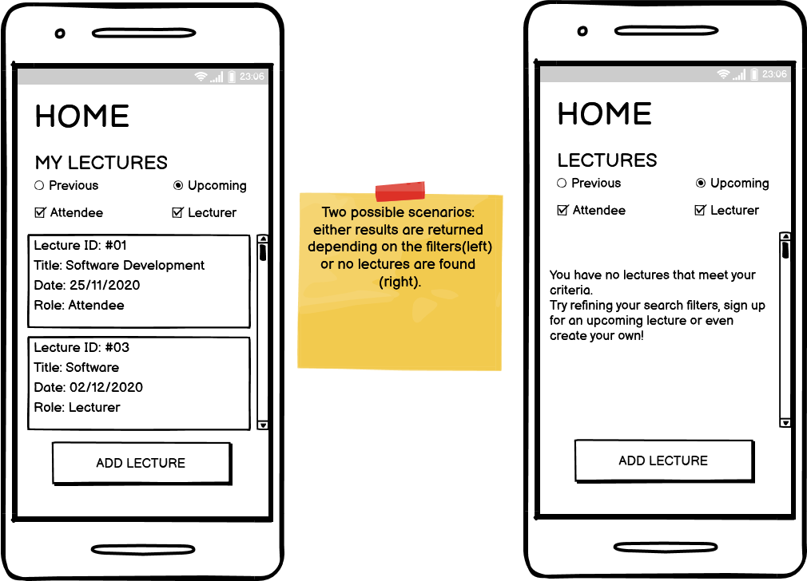
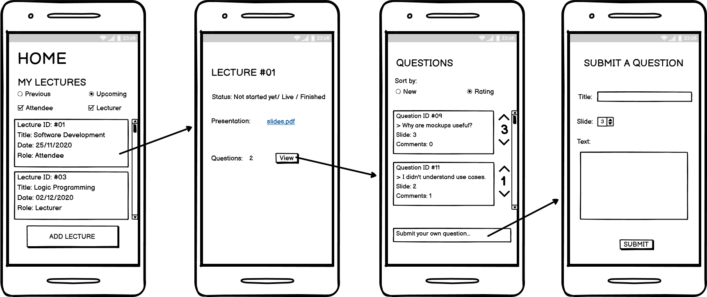
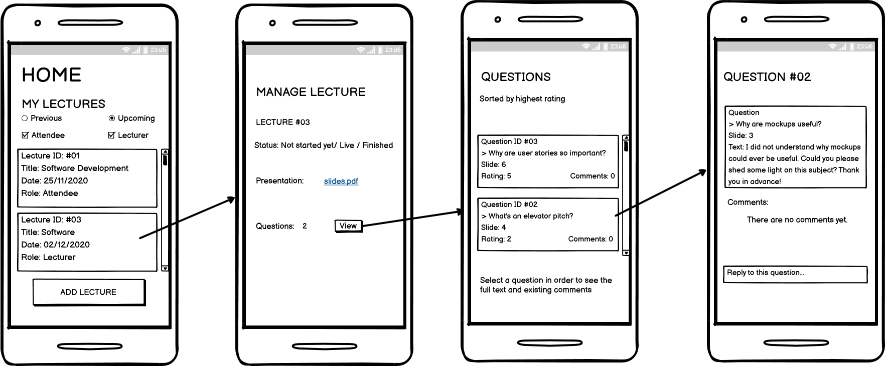

# Submit a Question
[Short description]

Team members:
<ul>
  <li>Fabio Moreira </li>
  <li>Luís Afonso  </li>
  <li>João Cunha </li>
  <li>Pedro Coelho </li>
  <li>José Maçães </li>
 </ul>

## Product Vision

## Elevator Pitch

Conference attendees often feel frustrated by the quality (or the lack thereof) of questions taking up the very limited time at the end. 
(productName) optimizes everyone's experience  by allowing all the attendees to vote on the best questions, leading to a better use of the time.
From now on you can attend any conference knowing that only the most pertinent questions will be asked, leading to more intriguing discussions.

## Requirements 
### Use case diagram

### User stories

### - User story #01: 
As a user, I want to log into the app.
#### User interface mockups

#### Acceptance tests

| Id |Given  |  When | Then
|--|--|--|--|
| 1 |There are fields for user to input email and password  | User fills those fields __AND__  the information is correct|  The user is logged in|
| 2 | There are fields for user to input email and password | User fills those fields __AND__ the information is incorrect | The user is not logged in __AND__ an error message is displayed |

#### Value and effort
Value: Must have

Effort: M

### - User story #02: 
As a user, I want to filter and view lectures that I have attended or will attend.
#### User interface mockups

#### Acceptance tests
| Id |Given  |  When | Then
|--|--|--|--|
|3 |A list of lectures associated with the user | User selects the "lecturer" filter | Only lectures where user was the lecturer are displayed
|4 |A list of lectures associated with the user | User selects the "attendee" filter | Only lectures where user was an attendee are displayed
|5 |A list of lectures associated with the user | User selects the "upcoming" filter | Only lectures that will be happening in the future are displayed
|6 |A list of lectures associated with the user | User selects the "previous" filter |Only lectures that already happened will be displayed

#### Value and effort
Value: Must have

Effort: XS / S / M / L / XL

### - User story #03: 
As a lecturer, I can create a new lecture
#### User interface mockups

#### Acceptance tests

| Id |Given  |  When | Then
|--|--|--|--|
|7 |The form for creating a new lecture | User fills all the fields |A new lecture is created and added to the user's lectures list with role "Lecturer"
|8| The form for creating a new lecture | User selects a date in the past | The creation process fails and an error message is displayed

#### Value and effort
Value: [ Must have / Should have / Could have / Will not have ]

Effort: XS / S / M / L / XL

### - User story #04: 
As a user, I want to be able to see upcoming lectures (w/ filters) and choose one to attend.
#### User interface mockups

#### Acceptance tests

| Id |Given  |  When | Then
|--|--|--|--|
|9| A list of the upcoming lectures | User presses the lecture they want to attend __AND__ they press the _Join_ button | Lecture is added to the lectures list of the user with role "Attendee"
|10 | A list of the upcoming lectures | User selects a lecture that is already at maximum capacity| Message is displayed to the user letting them know lecture is full

#### Value and effort
Value: [ Must have / Should have / Could have / Will not have ]

Effort: XS / S / M / L / XL

### - User story #05: 
As a lecturer, I can change the status of my presentation (Live/Finished)
#### User interface mockups

#### Acceptance tests

| Id |Given  |  When | Then
|--|--|--|--|
|11|The options regarding the status of the lecture | The current status is "Not started yet" __AND__ user presses "Live" | The status should change to "Live"
| 12 | The options regarding the status of the lecture | The current status is "Live" __AND__ user presses "Finished" | The status should change to "Finished"
| 13 | The options regarding the status of the lecture | The current status is "Live" __AND__ user presses "Not started yet" | The status should not change __AND__ an error message should be displayed
|14| The options regarding the status of the lecture| The current status is "Finished" __AND__ user presses any other state | The status should not change __AND__ an error message should be displayed

#### Value and effort
Value: [ Must have / Should have / Could have / Will not have ]

Effort: XS / S / M / L / XL

### - User story #06: 
As a lecturer I can submit my presentation so that attendees can follow along my presentation.
#### User interface mockups

#### Acceptance tests

| Id |Given  |  When | Then
|--|--|--|--|
|15|Lecturer is on the page of the Lecture | Lecturer presses the "Select File" button __AND__ chooses a file| The file should be uploaded

#### Value and effort
Value: [ Must have / Should have / Could have / Will not have ]

Effort: XS / S / M / L / XL

### - User story #07: 
As an attendee, I can access the slides submitted by the lecturer to follow along (given lecturer submitted)
#### User interface mockups

#### Acceptance tests
For each user story you should write also the acceptance tests (textually in Gherkin), i.e., a description of scenarios (situations) that will help to confirm that the system satisfies the requirements addressed by the user story.

#### Value and effort
Value: [ Must have / Should have / Could have / Will not have ]

Effort: XS / S / M / L / XL

### - User story #08: 
As a user I can select which slide I have a doubt so that it is easier for the lecturer to  answer my question.
#### User interface mockups

#### Acceptance tests
For each user story you should write also the acceptance tests (textually in Gherkin), i.e., a description of scenarios (situations) that will help to confirm that the system satisfies the requirements addressed by the user story.

#### Value and effort
Value: [ Must have / Should have / Could have / Will not have ]

Effort: XS / S / M / L / XL

### - User story #09: 
As a user, I can vote on which questions I like the most so that they are more likely to get answered.
#### User interface mockups

#### Acceptance tests
For each user story you should write also the acceptance tests (textually in Gherkin), i.e., a description of scenarios (situations) that will help to confirm that the system satisfies the requirements addressed by the user story.

#### Value and effort
Value: [ Must have / Should have / Could have / Will not have ]

Effort: XS / S / M / L / XL

### - User story #10: 
 As a lecturer I can look at the highest rated questions so that I can answer the most wanted questions first.
#### User interface mockups

#### Acceptance tests
For each user story you should write also the acceptance tests (textually in Gherkin), i.e., a description of scenarios (situations) that will help to confirm that the system satisfies the requirements addressed by the user story.

#### Value and effort
Value: [ Must have / Should have / Could have / Will not have ]

Effort: XS / S / M / L / XL

### - User story #11: 
As a user I can reply to other user's questions after the lecture has ended so that more questions can get answered.
#### User interface mockups

#### Acceptance tests
For each user story you should write also the acceptance tests (textually in Gherkin), i.e., a description of scenarios (situations) that will help to confirm that the system satisfies the requirements addressed by the user story.

#### Value and effort
Value: [ Must have / Should have / Could have / Will not have ]  

Effort: XS / S / M / L / XL

### Domain model
To better understand the context of the software system, it is very useful to have a simple UML class diagram with all the key concepts (names, attributes) and relationships involved of the problem domain addressed by your module.

## Architecture and Design
The architecture of a software system encompasses the set of key decisions about its overall organization.

A well written architecture document is brief but reduces the amount of time it takes new programmers to a project to understand the code to feel able to make modifications and enhancements.

To document the architecture requires describing the decomposition of the system in their parts (high-level components) and the key behaviors and collaborations between them.

In this section you should start by briefly describing the overall components of the project and their interrelations. You should also describe how you solved typical problems you may have encountered, pointing to well-known architectural and design patterns, if applicable.

### Logical architecture
The purpose of this subsection is to document the high-level logical structure of the code, using a UML diagram with logical packages, without the worry of allocating to components, processes or machines.

It can be beneficial to present the system both in a horizontal or vertical decomposition:

horizontal decomposition may define layers and implementation concepts, such as the user interface, business logic and concepts;
vertical decomposition can define a hierarchy of subsystems that cover all layers of implementation.
### Physical architecture
The goal of this subsection is to document the high-level physical structure of the software system (machines, connections, software components installed, and their dependencies) using UML deployment diagrams or component diagrams (separate or integrated), showing the physical structure of the system.

It should describe also the technologies considered and justify the selections made. Examples of technologies relevant for openCX are, for example, frameworks for mobile applications (Flutter vs ReactNative vs ...), languages to program with microbit, and communication with things (beacons, sensors, etc.).

### Prototype
To help on validating all the architectural, design and technological decisions made, we usually implement a vertical prototype, a thin vertical slice of the system.

In this subsection please describe in more detail which, and how, user(s) story(ies) were implemented.

## Implementation
Regular product increments are a good practice of product management.

While not necessary, sometimes it might be useful to explain a few aspects of the code that have the greatest potential to confuse software engineers about how it works. Since the code should speak by itself, try to keep this section as short and simple as possible.

Use cross-links to the code repository and only embed real fragments of code when strictly needed, since they tend to become outdated very soon.

### Test
There are several ways of documenting testing activities, and quality assurance in general, being the most common: a strategy, a plan, test case specifications, and test checklists.

In this section it is only expected to include the following:

test plan describing the list of features to be tested and the testing methods and tools;
test case specifications to verify the functionalities, using unit tests and acceptance tests.
A good practice is to simplify this, avoiding repetitions, and automating the testing actions as much as possible.

## Configuration and change management
Configuration and change management are key activities to control change to, and maintain the integrity of, a project’s artifacts (code, models, documents).

For the purpose of ESOF, we will use a very simple approach, just to manage feature requests, bug fixes, and improvements, using GitHub issues and following the GitHub flow.

## Project management
Software project management is an art and science of planning and leading software projects, in which software projects are planned, implemented, monitored and controlled.

In the context of ESOF, we expect that each team adopts a project management tool capable of registering tasks, assign tasks to people, add estimations to tasks, monitor tasks progress, and therefore being able to track their projects.

Example of tools to do this are:

Trello.com
Github Projects
Pivotal Tracker
Jira
We recommend to use the simplest tool that can possibly work for the team.
